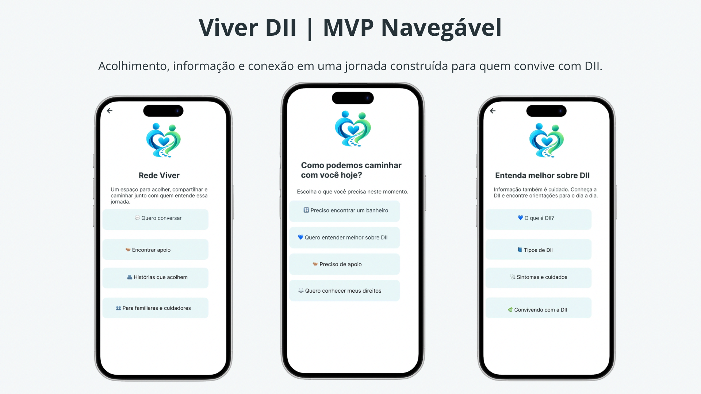
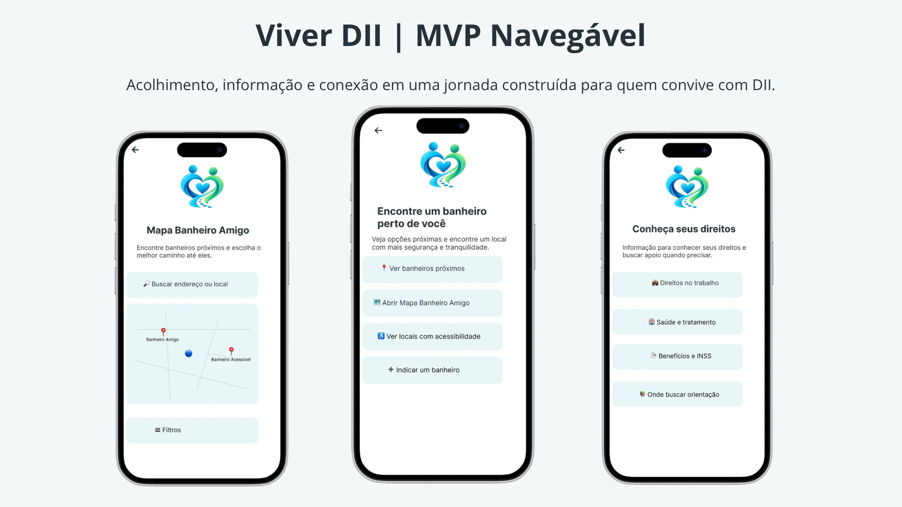

  

# 💙 Viver DII

### Acolhimento • Informação • Conexão

> **Você não precisa caminhar sozinho.**

O **Viver DII** é um projeto de impacto social em desenvolvimento, criado para acolher, informar e conectar pessoas que convivem com **Doenças Inflamatórias Intestinais (DII)**, além de familiares e cuidadores.

A proposta nasceu de uma vivência próxima com a DII e da percepção de que seus impactos vão muito além dos sintomas físicos, alcançando a rotina, o trabalho, os relacionamentos, os deslocamentos, o acesso à informação e aos direitos.

## 🌱 Nosso propósito

Criar um ambiente digital que reúna **apoio, informação acessível, conexão e recursos práticos** para ajudar quem convive com DII a ter mais autonomia e segurança no cotidiano.

> **Construir com as pessoas, e não apenas para elas.**

## 🧩 Ecossistema Viver DII

O projeto prevê diferentes frentes conectadas:

- 🤝 **Rede Viver** — acolhimento, conexão e troca de experiências
- 📚 **Informação sobre DII** — conteúdo acessível e organizado
- ⚖️ **Direitos** — orientações e caminhos de acesso
- 💼 **Trabalho** — informações sobre os desafios da DII no ambiente profissional
- 🚻 **Mapa Banheiro Amigo** — apoio para localizar banheiros e tornar deslocamentos mais seguros
- 💙 **Conteúdo para familiares e cuidadores**
- 🌐 **Parcerias futuras** com profissionais, organizações, empresas e estabelecimentos

## 📱 Conheça o MVP

O Viver DII já possui um **MVP navegável desenvolvido no Figma**, criado para demonstrar a experiência inicial do projeto e apoiar o processo de validação com usuários.

🔗 **[Acessar o protótipo do Viver DII no Figma](https://www.figma.com/proto/1Z6cWn2MHwNHhsjDCZWXWG/Viver-DII-%7C-MVP-Explorer-2026?node-id=101-16&t=exSuqIFMaH4BDhoP-0&scaling=scale-down&content-scaling=fixed&page-id=6%3A4&starting-point-node-id=101%3A16)**
### ✨ Um pouco da experiência Viver DII

> O MVP representa uma versão inicial da proposta. As funcionalidades apresentadas ainda estão em processo de validação e evolução.
>
> ## 💙 Participe da construção do Viver DII

O Viver DII está em fase de validação e queremos ouvir pessoas que convivem com DII, familiares e cuidadores.

Sua experiência pode nos ajudar a compreender necessidades reais e definir os próximos passos do projeto.

📋 **[Responder à Pesquisa Viver DII](https://docs.google.com/forms/d/e/1FAIpQLSe79FZ8_r4ZlMRbDHg6XGekQGwPIjGRGJNVHPOo5E0g7q3X-A/viewform)**

> Queremos construir o Viver DII com as pessoas, e não apenas para elas.

## 🚀 Estágio atual

✅ Identidade e Design System definidos  
✅ MVP navegável desenvolvido no Figma  
✅ Fluxo principal do usuário estruturado  
✅ Inscrição no Santander X Explorer 2026 concluída  
🔎 Validação com pessoas com DII, familiares e cuidadores em andamento

O MVP é um **protótipo navegável** criado para demonstrar e validar a proposta. As funcionalidades apresentadas ainda não representam um produto totalmente desenvolvido.

## 🎯 Próximo passo

Ouvir pessoas que vivem essa realidade, analisar suas necessidades e utilizar os aprendizados para definir as prioridades e a evolução do Viver DII.

## 🌍 Impacto

O Viver DII está alinhado ao **ODS 3 — Saúde e Bem-estar**, buscando contribuir para uma jornada com mais informação, acolhimento, autonomia e conexão.

---

### 💙 Viver DII
**Juntos, encontramos mais caminhos.**

Projeto idealizado por **Jaqueline Bueno**.
